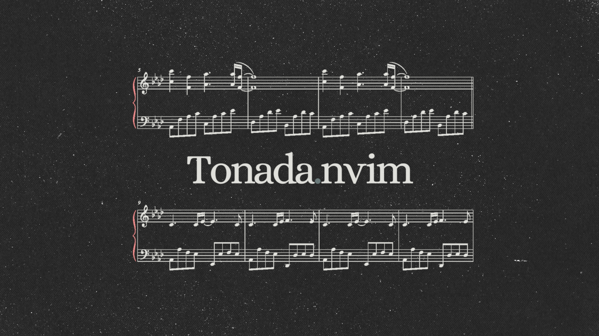
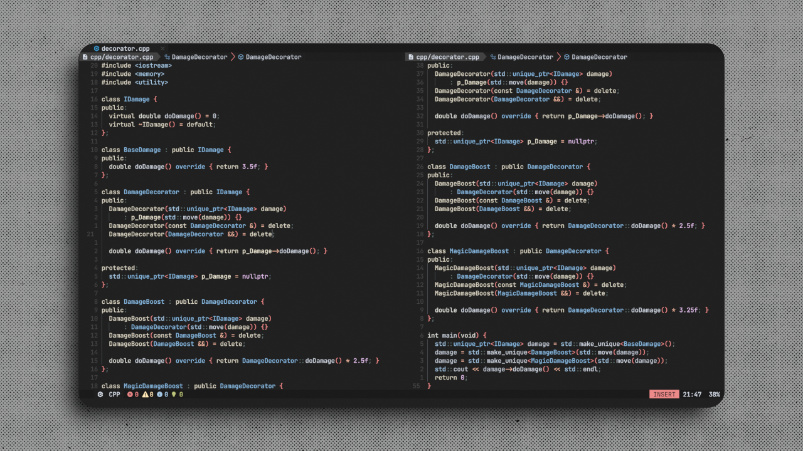
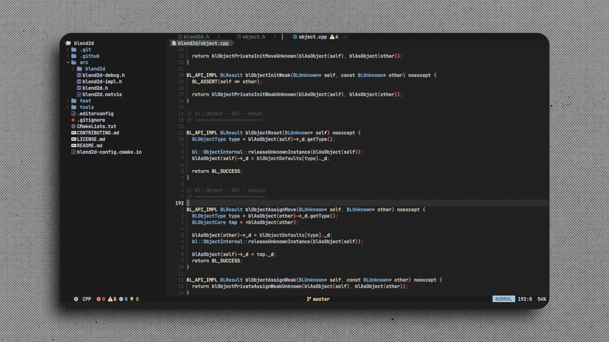
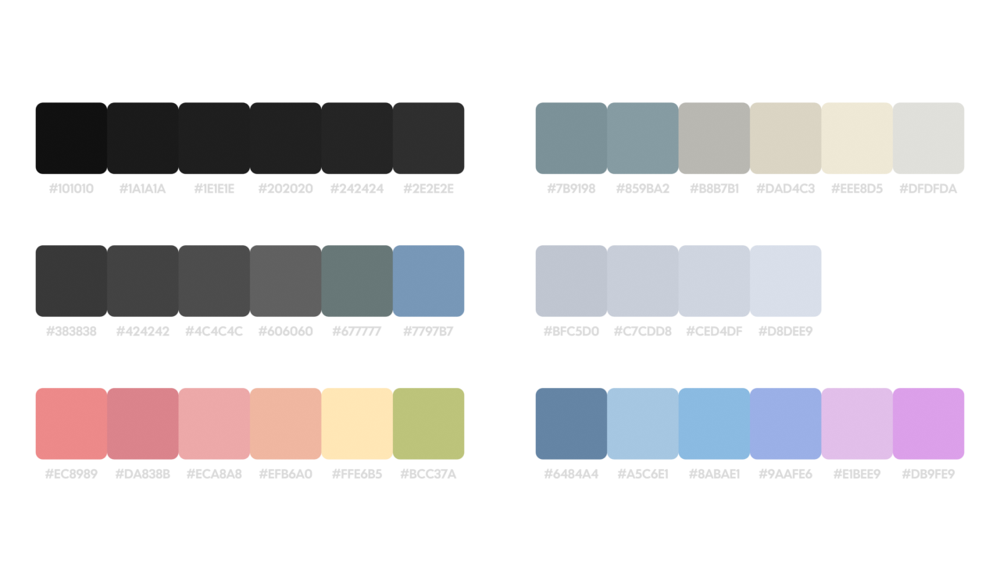

<div align="center">
    </img>
    <h1>tonada.nvim</h1>
    <p>A dark colorscheme with soft tones.</p>
    </img>
    </img>
</div>


## Installation

Using [lazy.nvim](https://github.com/folke/lazy.nvim):

```lua
{
  "ubaldobearki/tonada.nvim",
  config = function()
    vim.cmd("colorscheme tonada")
  end
},
```

## Supported plugins

* [Treesitter](https://github.com/nvim-treesitter/nvim-treesitter)
* [NvimTree](https://github.com/nvim-tree/nvim-tree.lua)
* [Telescope](https://github.com/nvim-telescope/telescope.nvim)
* [NvimCmp](https://github.com/hrsh7th/nvim-cmp)
* [NeoGit](https://github.com/NeogitOrg/neogit)
* [Notify](https://github.com/rcarriga/nvim-notify)
* [Navic](https://github.com/SmiteshP/nvim-navic)
* [LSP](https://github.com/neovim/nvim-lspconfig)

## Color Palette



## Contributing

PRs are very welcome and encouraged! c:

## Credits

Based on [NvChad/base46](https://github.com/NvChad/base46)'s Monochrome theme
